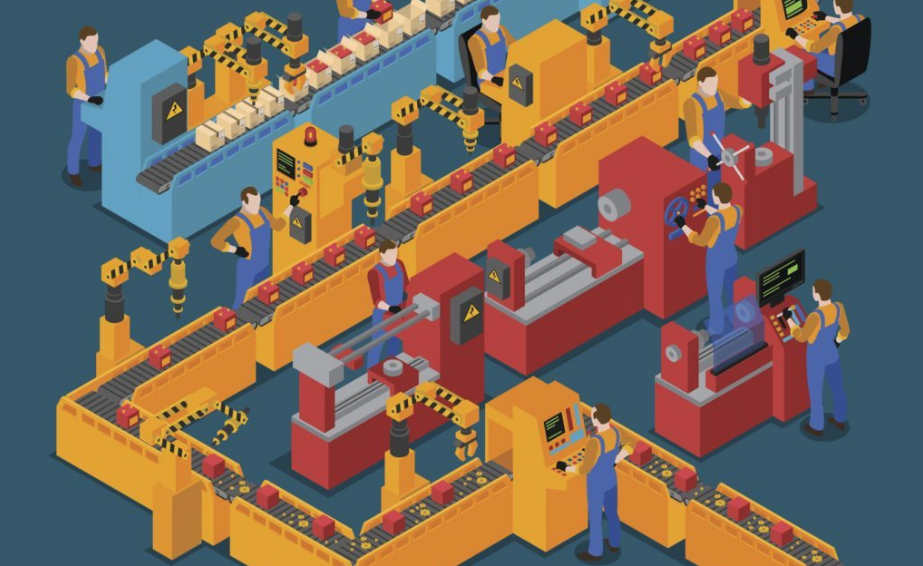
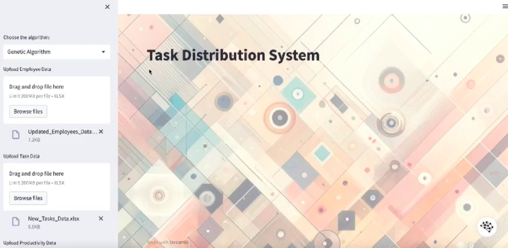

Workforce planning is no longer just about filling schedules — it's about optimizing human resources, enhancing employee satisfaction, and reducing operational costs. This project delivers AI-powered Smart Schedule Optimizers (SSO) that dynamically create efficient and balanced work schedules tailored to organizational needs through: 
- Predicting workload and demand fluctuations.
- Optimizing shift allocation based on skills and availability.
- Maximizing productivity while ensuring worker well-being.

Key Features of the project are:
 - **AI-Driven Decision Making**: Integration of ML models for job allocation and dynamic shift optimization.
 - **Heuristic Algorithms**: Use of Genetic Algorithms, Simulated Annealing & Ant Colony Optimization for complex scheduling scenarios.
 - **Modular Design**: Extensible components for data ingestion, scheduling engine, and performance evaluation.
 - **Customizability**: Adaptable to healthcare, retail, manufacturing, and service industries.
 - **Synthetic Data Generation**: Tools to simulate realistic employee/task datasets when real data is unavailable.

 Tech Stack:

| Component         | Technology                                      |
|------------------|--------------------------------------------------|
| Language          | Python                                           |
| ML Frameworks     | Scikit-learn, TensorFlow, PyTorch, Keras         |
| Optimization      | Genetic Algorithm, Simulated Annealing, ACO     |
| Data Processing   | Pandas, NumPy                                    |
| Visualization     | Matplotlib, Seaborn                              |

The project follows a structured pipeline:
 - **Problem Definition**: Define objectives, constraints, and real-world scheduling challenges.
 - **Data Collection**: Generate or gather synthetic data on employee availability, tasks, skills, etc.
 - **Model Design**: Implement ML & heuristic-based schedulers.
 - **Evaluation**: Benchmark algorithms based on efficiency, satisfaction, and cost reduction.
For details, refer to the full methodology in the [Workforce Planning Report](./Report/Workforce_Planning__Developing_Smart_AI_driven_Schedule_Optimizers.pdf).

 Possible Use Cases for the AI-powered SSO:
 - **Healthcare**: Optimize nurse/doctor shifts while balancing fatigue and preferences.
 - **Retail**: Align staff schedules with peak foot traffic using predictive analytics.
 - **Manufacturing**: Distribute tasks across shifts considering machine/operator availability.
 - **Customer Service**: Intelligent dispatching of agents based on call volumes.
  
  

